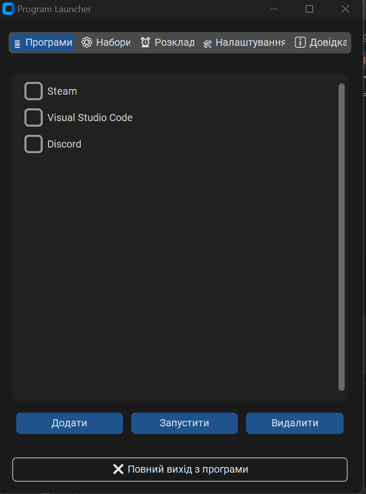
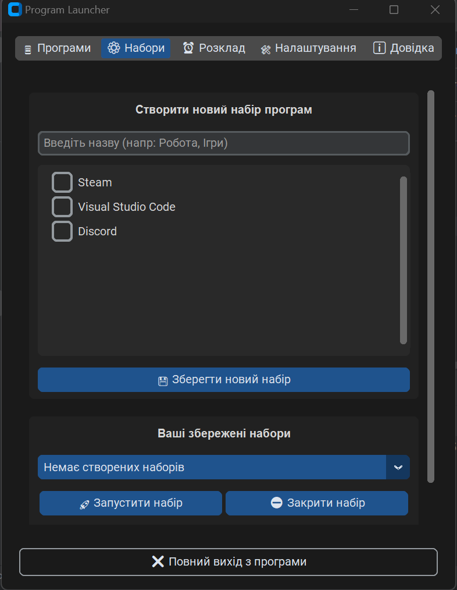
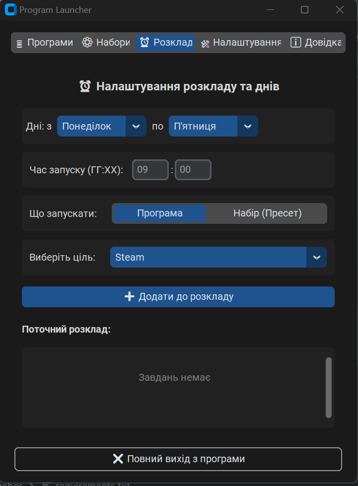
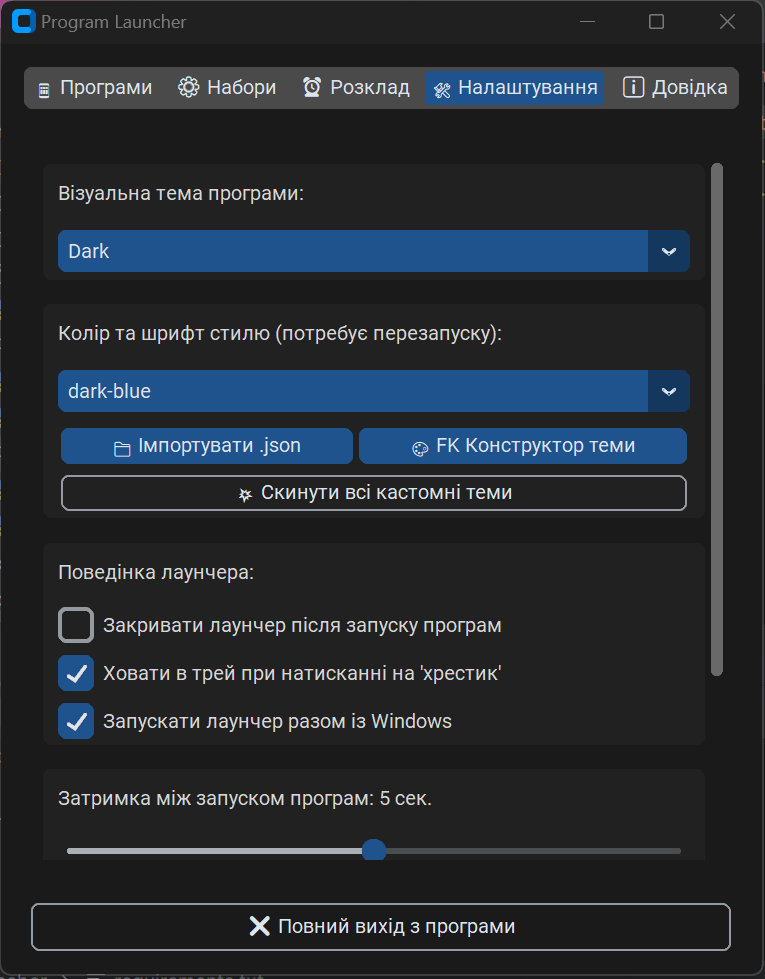

# Program Launcher

Гнучкий лаунчер для Windows, створений для автоматизації щоденних сценаріїв роботи. Дозволяє об'єднувати програми у набори, запускати їх одним кліком, створювати розклад автоматичного запуску та налаштовувати зовнішній вигляд інтерфейсу.

---

## ✨ Можливості

### 🚀 Керування програмами

* Додавання програм через Drag & Drop
* Підтримка `.exe`, `.lnk`, `.bat`, `.cmd`
* Швидкий запуск обраних програм
* Перейменування програм
* Видалення зі списку
* Масовий запуск через чекбокси

### 📦 Набори (Пресети)

* Створення власних наборів програм
* Запуск декількох програм одним кліком
* Автозапуск обраного набору
* Закриття всіх процесів набору

### ⏰ Планувальник

* Запуск програм за розкладом
* Запуск наборів за розкладом
* Вибір діапазону днів тижня
* Налаштування часу запуску
* Автоматичне виконання у фоновому режимі

### 🎨 Кастомізація

* Темна та світла тема
* Підтримка власних JSON-тем
* Імпорт готових тем
* Вбудований конструктор тем
* Налаштування кольорів та шрифтів

### ⚙️ Додаткові можливості

* Затримка між запуском програм
* Автозапуск разом із Windows
* Згортання у системний трей
* Автоматичне закриття після запуску програм
* Робота у фоновому режимі

---

## 📸 Скріншоти

### Головне вікно



### Керування наборами



### Планувальник



### Налаштування



---

## 🛠 Використані технології

* Python 3.11+
* CustomTkinter
* PyStray
* Pillow (PIL)
* ctypes / Win32 API
* JSON

---

## 📥 Встановлення

### Клонування репозиторію

```bash
git clone https://github.com/YOUR_USERNAME/ProgramLauncher.git
cd ProgramLauncher
```

### Встановлення залежностей

```bash
pip install -r requirements.txt
```

### Запуск

```bash
python ProgramLauncherStart.py
```

---

## 📂 Структура проєкту

```text
ProgramLauncher/
│
├── ProgramLauncherStart.py
├── preset_manager.py
├── schedule_manager.py
├── settings_manager.py
├── info_manager.py
│
├── jsons_saves/
│
├── themes/
│
├── screenshots/
│   ├── main.png
│   ├── presets.png
│   ├── scheduler.png
│   └── settings.png
│
├── LICENSE
└── README.md
```

---

## 🎯 Для чого підходить

* Автоматизація робочого середовища
* Швидкий запуск наборів програм
* Автоматичний старт програм за розкладом
* Організація щоденних сценаріїв роботи
* Запуск ігрових або робочих конфігурацій одним кліком

---

## 👤 Автор

**Inna Varchenko (YumekoDeVil)**

GitHub: https://github.com/6MrCrazy6

Email: devilyumeko42@gmail.com

---

## 📜 Ліцензія

Copyright © 2026 Inna Varchenko

Проєкт розповсюджується відповідно до умов ліцензії PolyForm Noncommercial License 1.0.0.

Детальні умови наведені у файлі [LICENSE](LICENSE).
