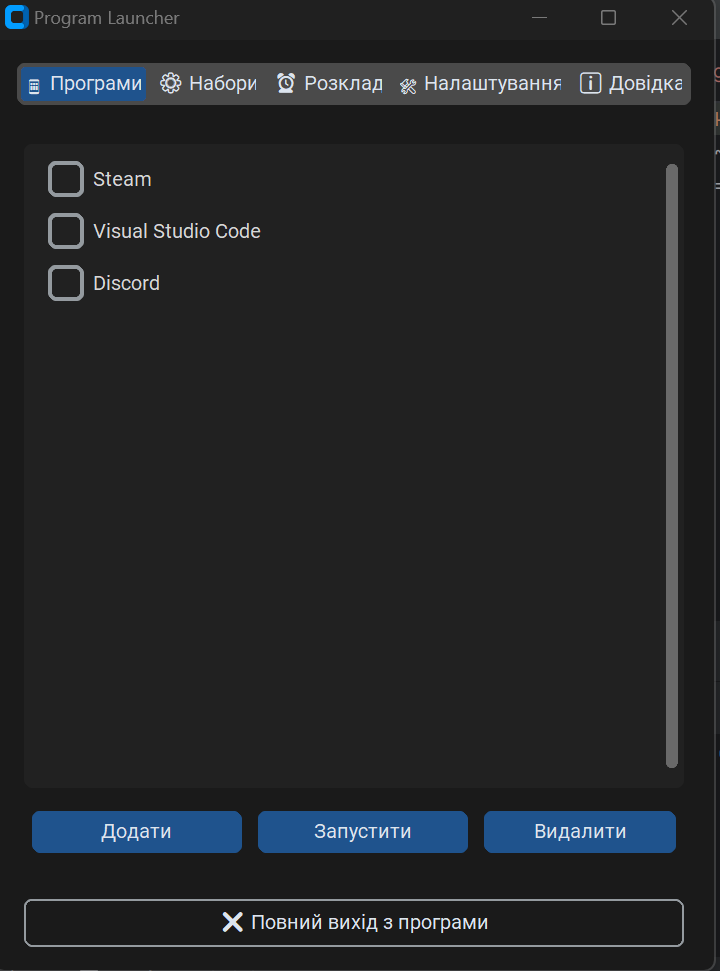
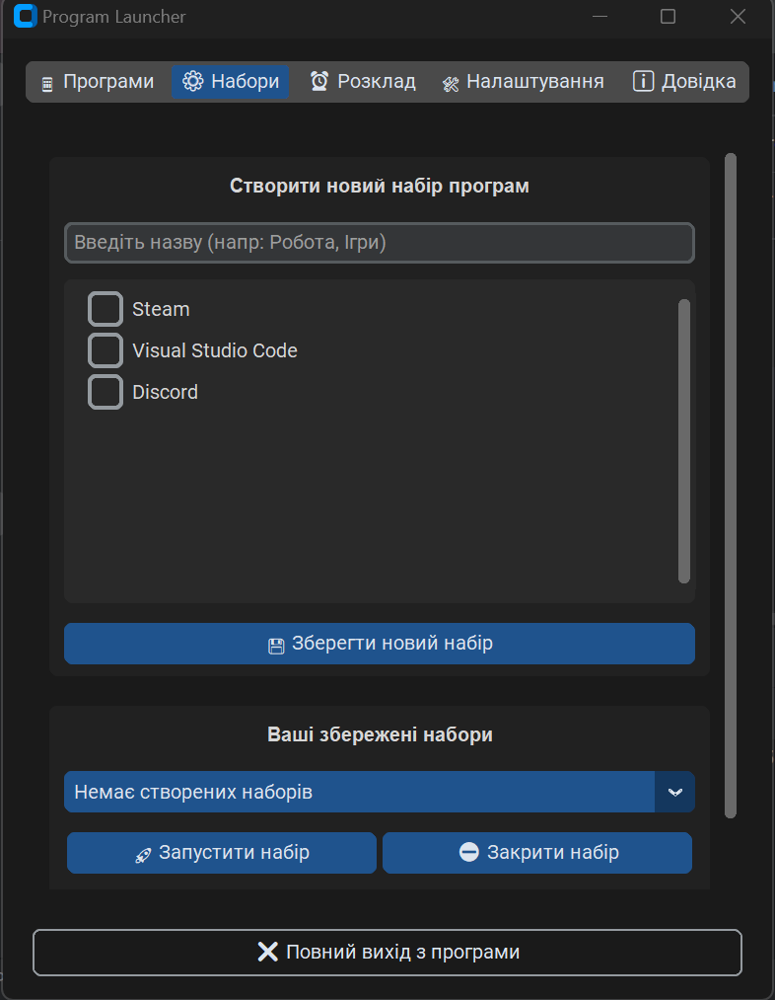
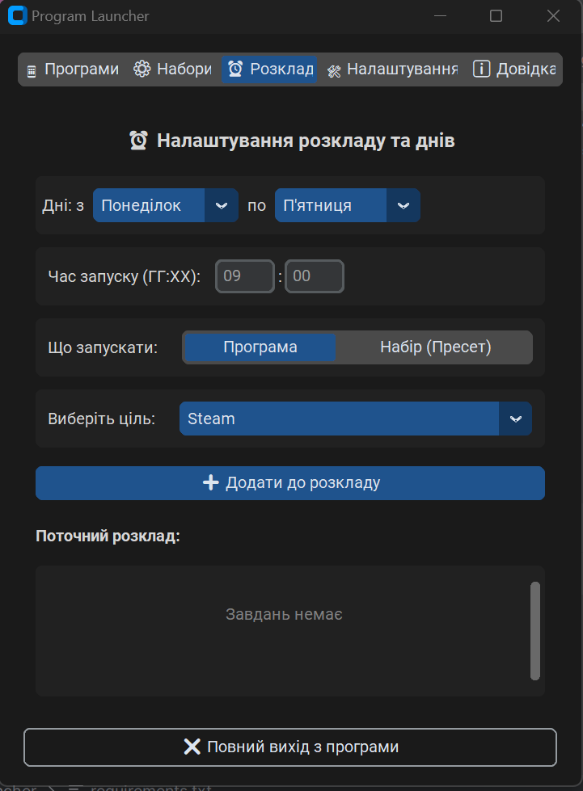
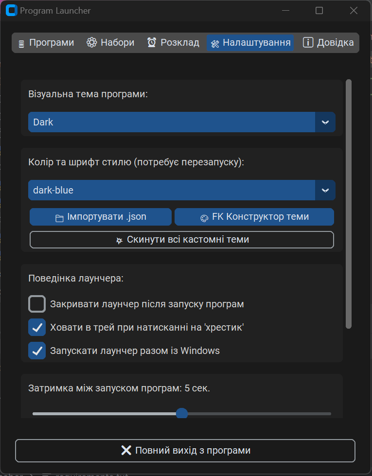

# Program Launcher 🚀

A professional-grade Windows automation utility designed to streamline your daily workflow. Organize your software, automate launches, and track your productivity with ease. Now with full multi-language support!

---

## ✨ Key Features

### 🧠 Intelligence & Automation
*   **Smart Launch:** Prevents duplicate windows by checking if a program is already running (powered by `psutil`).
*   **Usage Analytics:** Track how many times each app is launched. Identify your most-used tools and clean up the clutter.
*   **Global Hotkeys:** Summon the launcher or trigger specific presets with customizable system-wide shortcuts (e.g., `Ctrl+Alt+L`).
*   **Advanced Scheduler:** Non-blocking background scheduler to run apps or presets at specific times and day ranges.

### 🌍 Localization & UX
*   **Multi-language Support:** Easily switch between **English** and **Ukrainian**. The system is built on a modular JSON-based locale engine.
*   **Modern UI:** Built with `CustomTkinter` for a sleek, high-DPI aware interface with custom icons.
*   **Category System:** Group apps into tags like "Work", "Dev", or "Gaming". Filter your list instantly to find what you need.
*   **Native Drag & Drop:** Add apps by simply dragging `.exe`, `.lnk`, `.bat`, or `.cmd` files into the window.

### 📦 Smart Presets (Bundles)
*   **Custom Bundles:** Launch entire environments with one click. Presets inherit arguments and categories from your main list.
*   **Launch Arguments:** Full support for command-line parameters (e.g., specific URLs for browsers or startup flags for games).
*   **Startup Presets:** Choose a specific preset to run automatically when the launcher starts.

### 🎨 Customization & Reliability
*   **Theme Engine:** Switch between Light and Dark modes, or create your own with the built-in JSON theme constructor.
*   **System Tray Integration:** Runs quietly in the background; access everything from the tray icon.
*   **Portable Design:** No installation required. All settings, locales, and themes are stored in the application folder.
*   **Backup System:** Export your entire configuration to a ZIP archive and restore it anytime.

---

## 📸 Screenshots

### Main Window & Categories


### Preset Management


### Advanced Scheduler


### Settings & Customization


---

## 🛠 Tech Stack
*   **Python 3.11+**
*   **CustomTkinter:** Modern UI framework.
*   **psutil:** Process monitoring for Smart Launch.
*   **keyboard:** Global system-wide hotkeys.
*   **pystray & Pillow:** System tray and icon management.
*   **ctypes / Winreg:** Native Windows API integration.

---

## 📥 Getting Started

### 🚀 Option 1: For Users (Easiest)
If you just want to use the application, download the latest standalone `.exe` version from the **[Releases](https://github.com/6MrCrazy6/ProgramLauncher/releases)** page. 
*   No installation or Python required.
*   Just download and run!

### 💻 Option 2: For Developers
If you want to run the source code or contribute:

1. **Clone the repository:**
   ```bash
   git clone https://github.com/6MrCrazy6/ProgramLauncher.git
   cd ProgramLauncher
   ```

2. **Install dependencies:**
   ```bash
   pip install -r requirements.txt
   ```

3. **Run the application:**
   ```bash
   python ProgramLauncherStart.py
   ```

---

## 📂 Project Structure
*   `ProgramLauncherStart.py`: Main entry point and UI orchestration.
*   `locale_manager.py`: Multi-language engine and string management.
*   `process_utils.py`: Smart launch and process management logic.
*   `hotkey_manager.py`: Global hotkey registration and handling.
*   `stats_manager.py`: Usage tracking and analytics.
*   `preset_manager.py`: Logic for program bundles and categories.
*   `schedule_manager.py`: Background scheduling engine.
*   `settings_manager.py`: Themes, backups, and system settings.
*   `app_paths.py`: Portable path resolution.

---

## 👤 Author
**Inna Varchenko (YumekoDeVil)**
*   GitHub: [6MrCrazy6](https://github.com/6MrCrazy6)
*   Email: devilyumeko42@gmail.com

---

## 📜 License
This project is distributed under the **PolyForm Noncommercial License 1.0.0**. See the [LICENSE](LICENSE) file for details.
